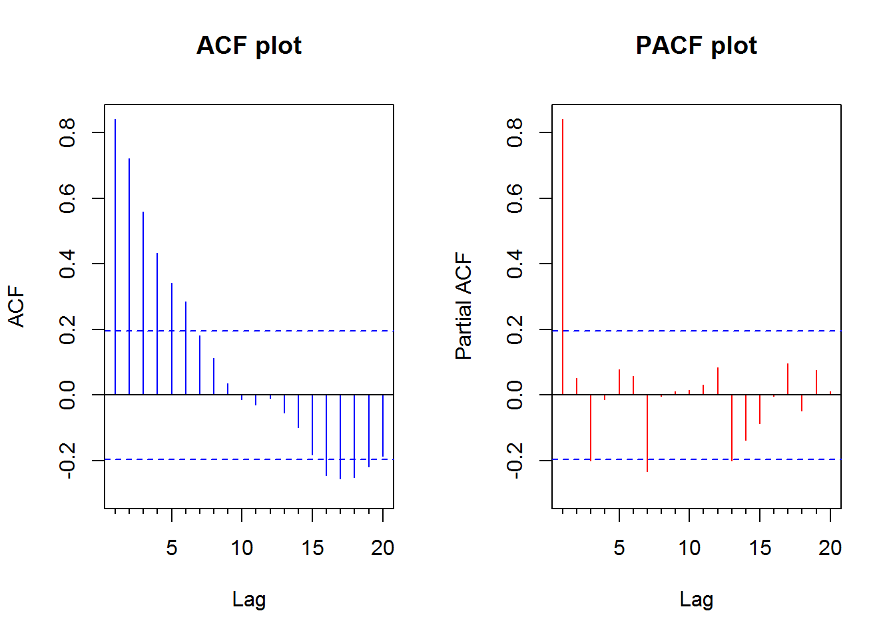
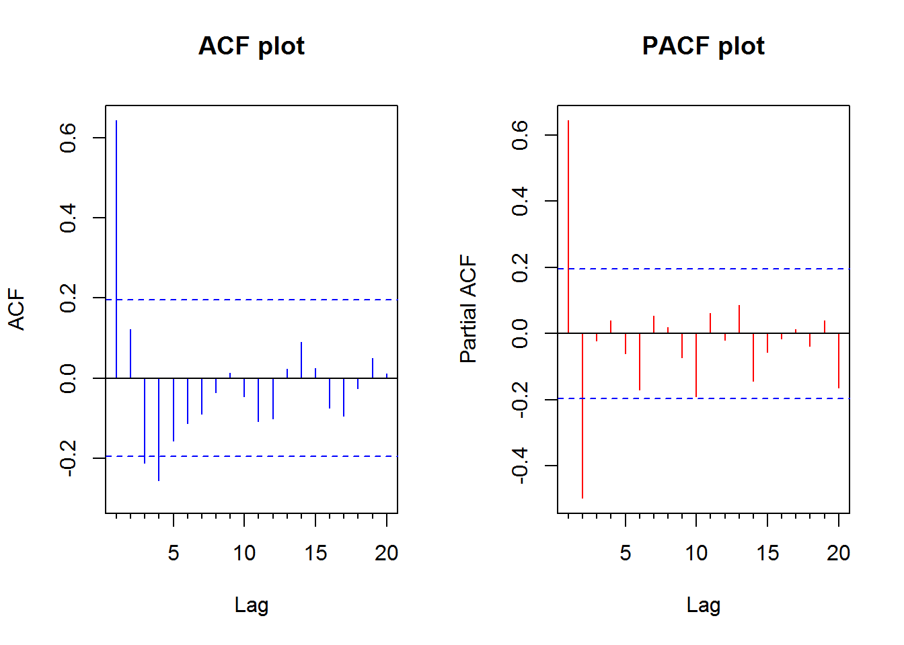
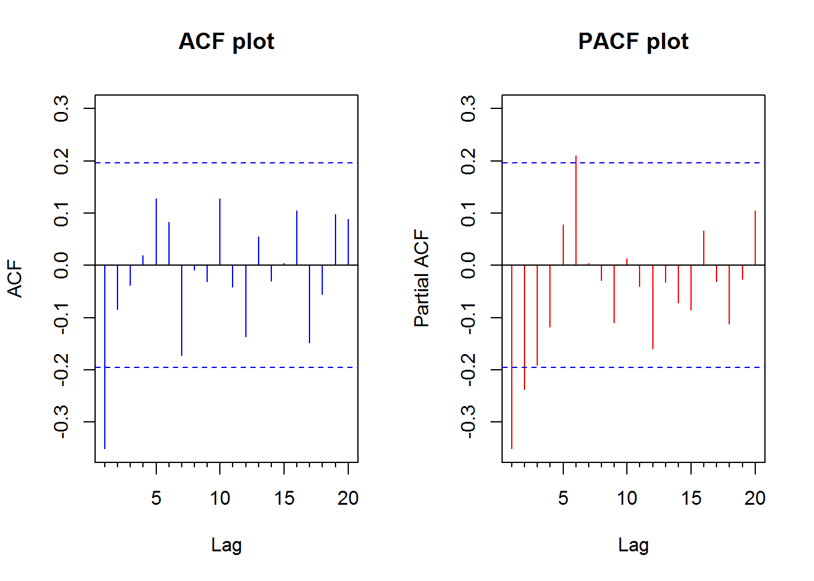
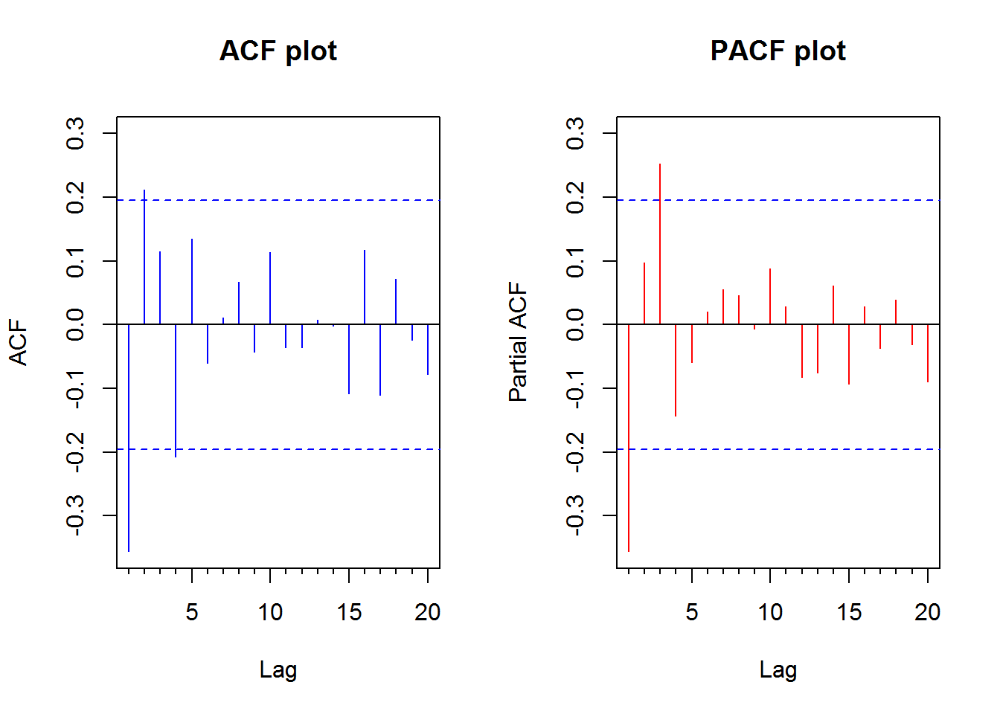
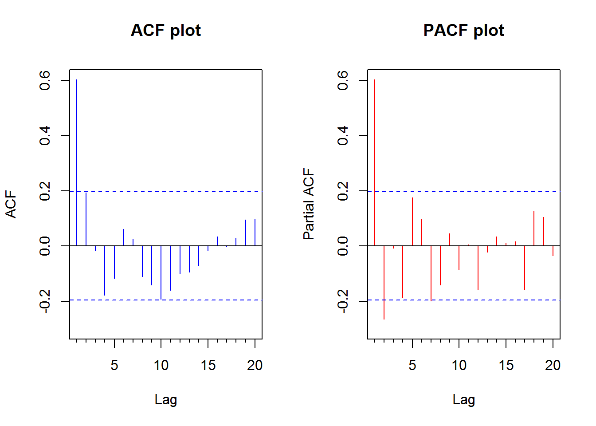
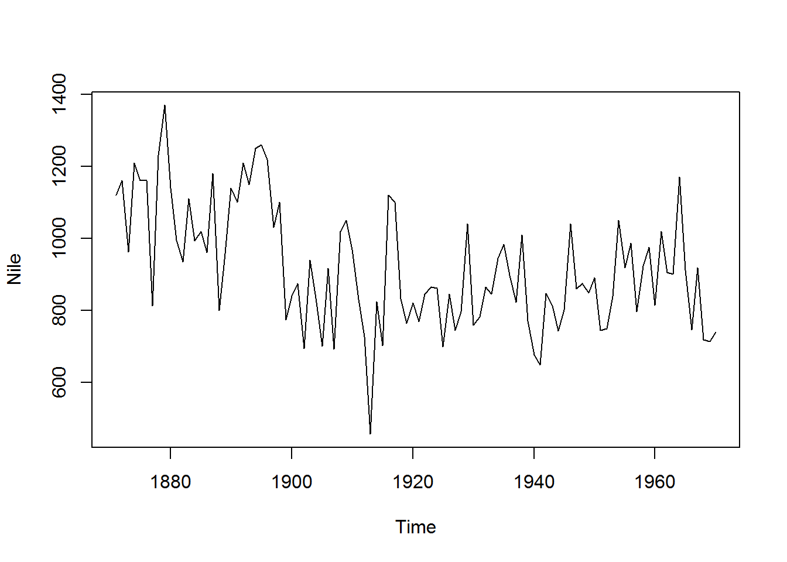
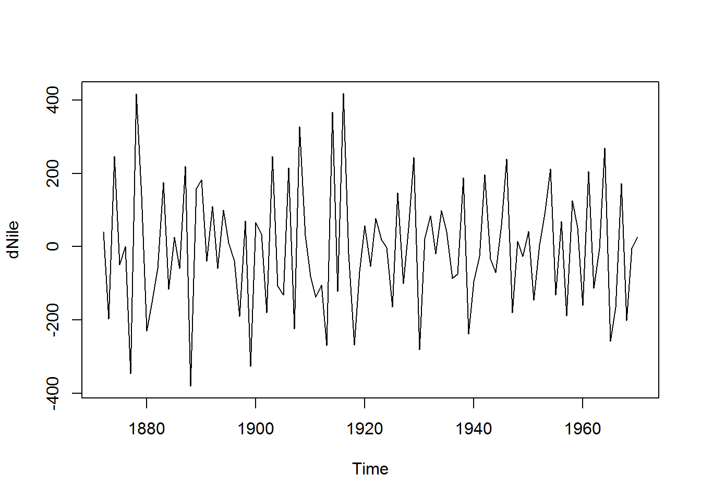
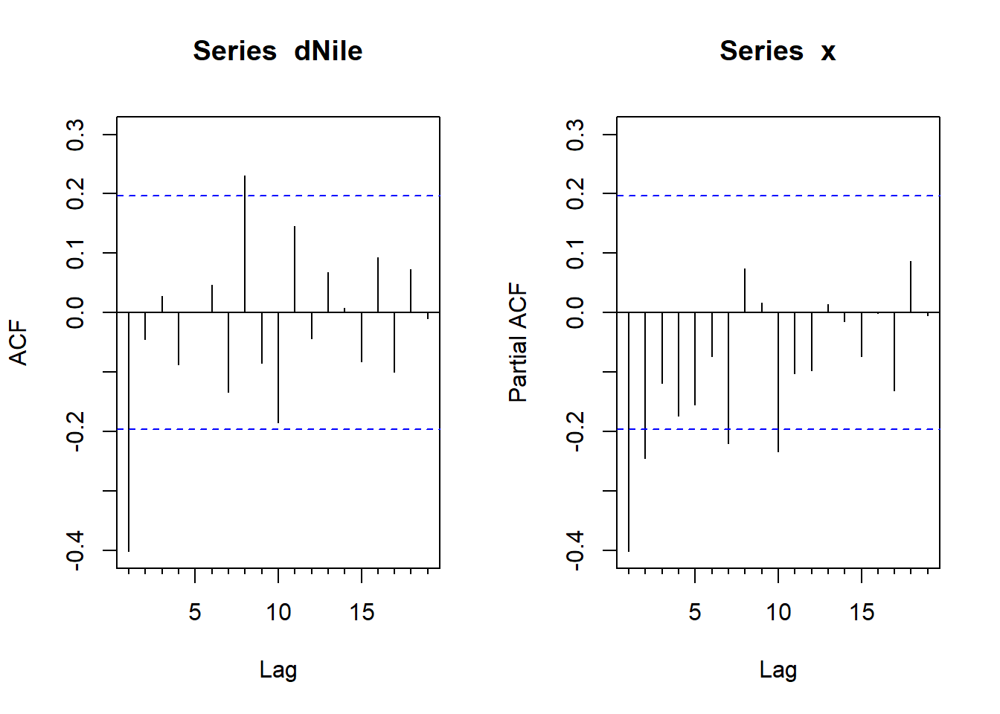
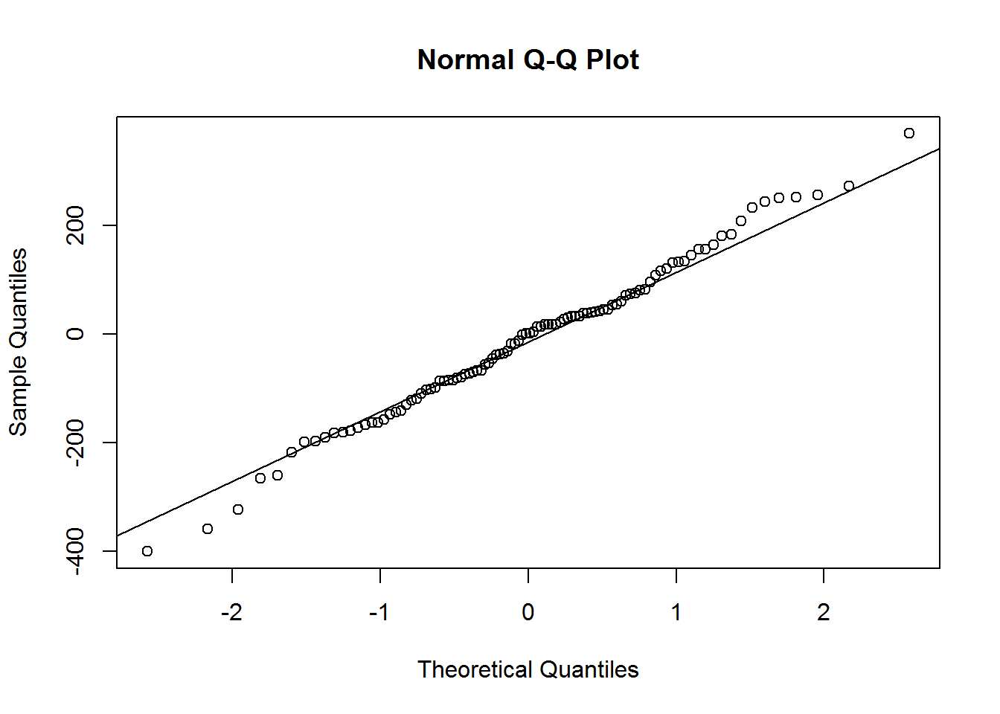
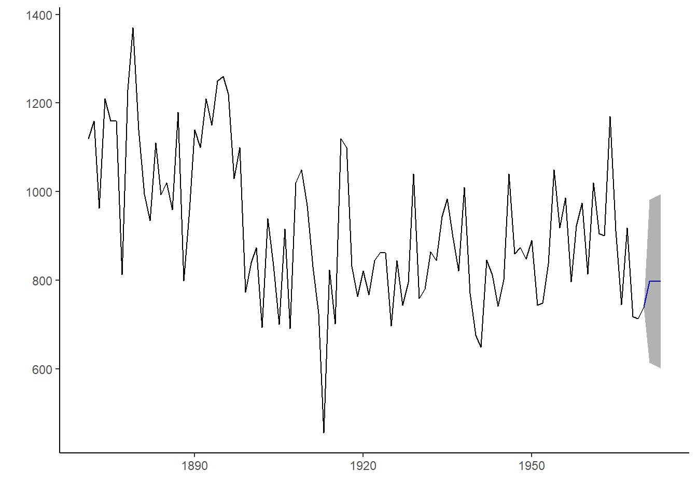

# Mô hình ARIMA

## Chuỗi thời gian dừng

Chuỗi thời gian dừng là yêu cầu bắt buộc để xây dựng mô hình ARIMA. 

Định nghĩa chuối thời gian dừng:
  
  - Giá trị trung bình không đổi theo thời gian 


- Phương sai không đổi theo thời gian (homoskedaticity)


- Covariance của chuỗi thời gian thứ i và (i+m) không đổi


## Mô hình ARIMA

ARIMA là viết tắt của `Auto-Regressive Integrated Moving Average`

$$ARIMA(p,d,q) = AR(p) + I(d) + MA(q)$$

Trong đó:

- p: Số bậc trong mô hình Auto-Regressive
- d: Số bậc trong mô hình Itegrated (số lần lấy $\delta$ để có chuỗi thời gian dừng)
- q: Số bậc trong mô hình Moving Agerage

**Integrated model**
  
  Gọi $Y_1,...,Y_t$ là chuỗi thời gian gốc. Ta có:
  
  - d=0: $y_t=Y_t$ 
  - d=1: $y_t=Y_t-Y_{t-1}$
  - d=2: $y_t=(Y_t-Y_{t-1})-(Y_{t-1}-Y_{t-2})$
  
  Với d=2, còn được gọi là "the first difference of the first difference". Sau khi được chuỗi dừng $y_t$, ta có thể dự báo mô hình ARIMA như sau:
  
  $$\hat{y}_t=\mu + \phi_1y_{t-1}+...+\phi_py_{t-p} + \theta_1\epsilon_{t-1}+...+\theta_q\epsilon_{t-q}$$
  
  **ACF vs. PACF**
  
  - ACF: Autocorrelation - đo correlation giữa các quan sát trong chuỗi
- PACF: Partial Auto Correlation - đo correlation giữa biến $Y_t$ và $Y_{t-k}$, loại bỏ các biến ở giữa chúng

**Kỹ thuật tạo chuỗi dừng**:
  
  - Với biến có var biến đổi: log
- Với biến có mean biến đổi: Sử dụng "Difference"

**Test chuỗi dừng**: Test ADF (Augmented Dickey-Fuller)

- $H_0$: Chuỗi không dừng (non-stationary)
- $H_1$: Chuỗi dừng (stationary)

**Lựa chọn tham số trong ARIMA**


+----------------+-----------------------------------------+---------------------+
|     Model      |                   ACF                   |        PACF         |
+================+=========================================+=====================+
|   ARIMA(p,d,0) | Giảm dần đều về 0                       | Giảm về 0 sau lag p |
+----------------+-----------------------------------------+---------------------+
| ARIMA(0,d,q)   | Giảm về 0 sau lag q   Giảm dần đều về 0 |                     |
+----------------+-----------------------------------------+---------------------+
| ARIMA(p,d,q)   | Giảm dần đều về 0                       | Giảm dần đều về 0   |
+----------------+-----------------------------------------+---------------------+


Xem xét ACF & PACF trong các chuỗi sau


```r
library(forecast)
library(tseries)
library(dplyr)
library(ggfortify)
ar1 <- arima.sim(list(ar=c(0.89)), n = 100)
ar2 <- arima.sim(list(ar=c(0.89, -0.4858)), n = 100)
ma1 <- arima.sim(n = 100, list(ma = c(-0.2279)))
ma2 <- arima.sim(n = 100, list(ma = c(-0.2279, 0.2488)))
arma <- arima.sim(n = 100, list(ar = c(0.8897, -0.4858), 
                                ma = c(-0.2279, 0.2488)))
#Tạo function
tseries.plot <- function(x){
  par(mfrow=c(1,2));
  Acf(x, col = "blue", main = paste(c("ACF plot")));
  Pacf(x, col = "red", main = paste(c("PACF plot")));
}
purrr::map(list(ar1, ar2, ma1, ma2, arma), tseries.plot)
```



```
## [[1]]
## 
## Partial autocorrelations of series 'x', by lag
## 
##      1      2      3      4      5      6      7      8      9     10 
##  0.839 -0.070 -0.072 -0.014 -0.164 -0.050 -0.011 -0.069  0.111  0.030 
##     11     12     13     14     15     16     17     18     19     20 
##  0.139 -0.011  0.007  0.019  0.059 -0.119 -0.050 -0.010  0.016 -0.002 
## 
## [[2]]
## 
## Partial autocorrelations of series 'x', by lag
## 
##      1      2      3      4      5      6      7      8      9     10 
##  0.619 -0.523  0.036 -0.020 -0.051 -0.229  0.018  0.094 -0.146 -0.011 
##     11     12     13     14     15     16     17     18     19     20 
## -0.014  0.052  0.263 -0.046  0.114  0.026 -0.021 -0.116 -0.043 -0.041 
## 
## [[3]]
## 
## Partial autocorrelations of series 'x', by lag
## 
##      1      2      3      4      5      6      7      8      9     10 
## -0.119  0.053  0.006  0.140 -0.064 -0.008 -0.067  0.201 -0.026 -0.077 
##     11     12     13     14     15     16     17     18     19     20 
##  0.113 -0.075 -0.071  0.013 -0.044  0.004  0.030  0.090 -0.008  0.005 
## 
## [[4]]
## 
## Partial autocorrelations of series 'x', by lag
## 
##      1      2      3      4      5      6      7      8      9     10 
##  0.113  0.215 -0.255 -0.107  0.121 -0.073  0.003 -0.049  0.041 -0.043 
##     11     12     13     14     15     16     17     18     19     20 
## -0.108 -0.295 -0.021 -0.182  0.019 -0.009  0.019 -0.014 -0.045 -0.098 
## 
## [[5]]
## 
## Partial autocorrelations of series 'x', by lag
## 
##      1      2      3      4      5      6      7      8      9     10 
##  0.593 -0.316 -0.161  0.050 -0.014  0.044 -0.140  0.066 -0.009  0.010 
##     11     12     13     14     15     16     17     18     19     20 
##  0.020  0.086  0.030 -0.026 -0.037  0.004 -0.022  0.052  0.199  0.063
```

## Ví dụ với R


```r
library(forecast)
library(tseries)
plot(Nile)
```



```r
#Tìm giá trị tối ưu của d để loại trend
ndiffs(Nile)
```

```
## [1] 1
```

```r
dNile <- diff(Nile, 1)
plot(dNile)
```



```r
adf.test(dNile)
```

```
## Warning in adf.test(dNile): p-value smaller than printed p-value
```

```
## 
## 	Augmented Dickey-Fuller Test
## 
## data:  dNile
## Dickey-Fuller = -6.5924, Lag order = 4, p-value = 0.01
## alternative hypothesis: stationary
```

```r
#Xem mô hình
par(mfrow=c(1,2))
Acf(dNile)
Pacf(dNile)
```



```r
#ACF và PACF đưa ra gợi ý mô hình ARIMA(0,1,1): ACF giảm về 0 sau lag 1, PACF giảm dần về 0
fit <- arima(Nile, order = c(0,1,1))
fit
```

```
## 
## Call:
## arima(x = Nile, order = c(0, 1, 1))
## 
## Coefficients:
##           ma1
##       -0.7329
## s.e.   0.1143
## 
## sigma^2 estimated as 20600:  log likelihood = -632.55,  aic = 1269.09
```

```r
accuracy(fit)
```

```
##                    ME     RMSE      MAE       MPE     MAPE     MASE
## Training set -11.9358 142.8071 112.1752 -3.574702 12.93594 0.841824
##                   ACF1
## Training set 0.1153593
```

```r
#Đánh giá mô hình
par(mfrow=c(1,1))
names(fit)
```

```
##  [1] "coef"      "sigma2"    "var.coef"  "mask"      "loglik"   
##  [6] "aic"       "arma"      "residuals" "call"      "series"   
## [11] "code"      "n.cond"    "nobs"      "model"
```

```r
qqnorm(fit$residuals)
qqline(fit$residuals)
```



```r
Box.test(fit$residuals, type = "Ljung-Box")
```

```
## 
## 	Box-Ljung test
## 
## data:  fit$residuals
## X-squared = 1.3711, df = 1, p-value = 0.2416
```

```r
#H0: Autocorrelation của residual bằng 0
#H1: Autocorrelation của residual khác 0

#Dự báo
forecast(fit, 3)
```

```
##      Point Forecast    Lo 80    Hi 80    Lo 95    Hi 95
## 1971       798.3673 614.4307 982.3040 517.0605 1079.674
## 1972       798.3673 607.9845 988.7502 507.2019 1089.533
## 1973       798.3673 601.7495 994.9851 497.6663 1099.068
```

```r
autoplot(forecast(fit,3)) + theme_classic()
```



```r
#Tự động chọn mô hình
auto.arima(Nile)
```

```
## Series: Nile 
## ARIMA(1,1,1)                    
## 
## Coefficients:
##          ar1      ma1
##       0.2544  -0.8741
## s.e.  0.1194   0.0605
## 
## sigma^2 estimated as 20177:  log likelihood=-630.63
## AIC=1267.25   AICc=1267.51   BIC=1275.04
```

Mô hình trên cho thấy ARIMA(0,1,1) phản ánh tốt số lượng:
  
- Residual có phân phối chuẩn
- Residual có autocorrelation bằng 0 (p value > 0.24)
