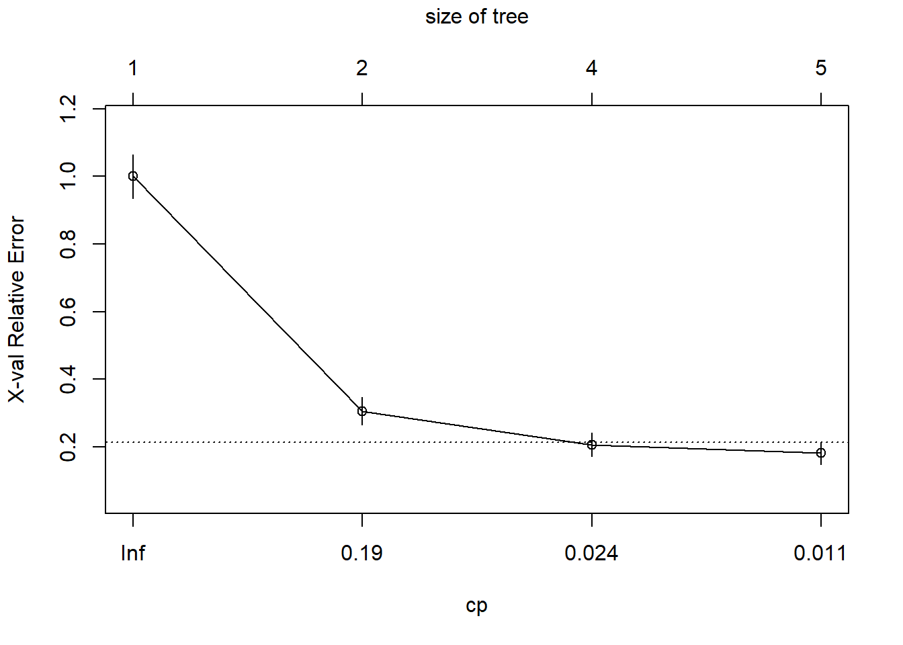

# Cây quyết định


Trong chương này, chúng ta sẽ sẽ tìm hiểu về những phương pháp dựa vào cây quyết định (`tree-based` methods) để giải quyết những bài toán hồi quy (`regression`) cũng như những bài toán phân loại (`classification`). Các phương pháp này sẽ nhóm các quan sát vào một số vùng (`regions`) nhất định, và để dự báo một quan sát mới, chúng ta thường sử dụng giá trị trung bình (đối với bài toán hồi quy) hoặc giá trị mode, hay majority vote (đối với bài toán phân loại) của những quan sát tập dữ liệu training trong vùng mà quan sát đó thuộc về.

Trong chương này, chúng ta sẽ được giới thiệu lần lượt các phương pháp `tree-based` điển hình như: `decision trees`, `bagging`, `random forests` và `boosting`. 


## Giới thiệu

Phương pháp `decision trees` (cây quyết định) gồm tập hợp các nguyên tắc phân nhóm (`spliting rules`) được sử dụng để nhóm các quan sát vào một số vùng (`regions`) nhất định mà được thống kê trong một cây. 

Phương pháp `decision trees` có thể áp dụng đối với cả hai bài toán hồi quy (regression) và phân loại (classification).

<center></center>

---

## Regression Trees

Phương pháp cây quyết định hồi quy (regression trees) dùng cho trường hợp khi biến đầu ra chúng ta muốn dự báo là biến liên tục hay biến định lượng

Chúng ta sẽ sử dụng dữ liệu có sẵn trong `R` - `Hitters` trong packge **ISLR** để dự báo thu nhập của cầu thủ bóng chày (`salary`) dựa vào số năm chơi bóng tại các giải đấu lớn (`years`) và số điểm ghi được trong mùa giải trước (`hits`).


```r
library(ISLR)
library(tidyverse)

data("Hitters")
names(Hitters) <- names(Hitters) %>% tolower

# Lấy 3 biến: `years`, `hits`, `salary`
data <- Hitters %>% 
  select(years,hits,salary)
```


Đầu tiên chúng ta sẽ loại bỏ những quan sát bị missing ở biến `salary`, và lấy log của biến `salary` để biến này tiệm cận với phân phối chuẩn hơn (phân phối hình chuông). Biến `salary` đơn vị là nghìn USD.


```r
data_new <- data %>%
  # Loại bỏ giá trị missing ở biến `salary`
  filter(!is.na(salary)) %>% 
  # log-transform
  mutate(salary = log(salary))

# Biểu đồ phân phối biến `salary` của `data`
data %>% 
  ggplot(aes(salary))+
  geom_density()+
  theme_minimal()
```


```r
# Biểu đồ phân phối biến `salary` của `data_new`
data_new %>% 
  ggplot(aes(salary))+
  geom_density()+
  theme_minimal()
```


Giả sử chúng ta xây dựng một cây hồi quy (regression tree) với dữ liệu nói trên và thu được kết quả như sau:


  
---

<center></center>


---

Với tập dữ liệu này, trung bình log-transform salary là 5.9, tức thu nhâp trung bình của các cầu thủ bóng chày là exp(5.9) = 375 (nghìn USD).

Cây quyết định trên bao gồm tập hợp các nguyên tắc phân nhóm (`spliting rules`), bắt đầu từ trên xuống dưới.

Với nguyên tắc phân nhóm đầu tiên `Years < 4.5` thì ở nhánh bên trái là những quan sát thỏa mãn điều kiện trên, và trung bình log-transform salary của nhóm này là 5.1. Nghĩa là, nhóm cầu thủ có số năm chơi bóng tại các giải đấu lớn ít hơn 4.5 năm có mức thu nhập trung bình là exp(5.1) = 164 (nghìn USD). 

Còn đối với những cầu thủ mà chơi bóng từ 4.5 năm trở lên tại các giải đấu lớn thì có thu nhập trung bình là exp(6.4) = 601 (nghìn USD). Tuy nhiên nhóm này còn chia thành 2 nhóm nhỏ hơn với nguyên tắc phân nhóm `Hits < 118`.

- Nhóm thỏa mãn điều kiện `Hits < 118` (số điểm ghi được trong mùa giải trước ít hơn 118) có mức thu nhập trung bình là exp(6) = 403 (nghìn USD)

- Nhóm ghi được từ 118 điểm trở lên tại mùa giải trước có mức thu nhập trung bình là exp(6.7) = 812 (nghìn USD).

Như vậy, cây quyết định nói trên đã phân loại các cầu thủ và 3 vùng/nhóm (`regions of predictor space`):

- R1: years < 4.5

- R2: years >= 4.5, hits < 118

- R3: years >= 4.5, hits >= 118


```r
data_new %>% 
  ggplot(aes(years,hits)) +
  geom_point(col = "gold")+
  theme_bw()+
  geom_vline(aes(xintercept = 4.5), col = "blue", size = 1)+
  geom_segment(aes(x = 4.5, 
                   y = 118, 
                   xend = Inf, 
                   yend = 118
                   ), 
               col = "blue",
               size = 1)+
  theme(panel.grid = element_blank())+
  scale_x_continuous(breaks = 4.5)+
  scale_y_continuous(breaks = 118)+
  theme(axis.text = element_text(face = "bold", size = 10))+
  annotate("text", x = 4.5/2, y = 118, label = "R1", col = "red", size = 6)+
  annotate("text", x = (32-4.5)/2, y = 118/2, label = "R2", col = "red", size = 6)+
  annotate("text", x = (32-4.5)/2, y = 118*1.5, label = "R3", col = "red", size = 6)
```


Mức thu nhập dự báo của 3 nhóm này lần lượt là 164,000 USD, 403,000 USD, 812,000 USD.

Trong ví dụ này R1, R2, R3 ở đây được gọi là `terminal nodes` hoặc `leaves` (lá cây). `years < 4.5` và `hits < 118` được gọi là `internal nodes` hoặc `decision nodes`.

Chúng ta có thể diễn giải cây quyết định hồi quy nói trên như sau: Biến `years` là quan trọng nhất ảnh hưởng tới việc dự báo `salary`. Nhóm cầu thủ có số năm chơi bóng tại các giải đấu lớn nhiều hơn sẽ có mức thu nhập cao hơn. Nhóm cầu thủ có số năm chơi bóng dưới 4.5 năm thì số điểm họ ghi được trong mùa giải trước đấy không ảnh hưởng đến thu nhập của họ, trong khi đó nhóm cầu thủ có số năm chơi bóng từ 4.5 năm trở lên tại các giải đấu lớn thì ngược lại. Số điểm ghi được trong mùa giải trước đó của nhóm cầu thủ này có ảnh hưởng đến thu nhập của họ, nhóm cầu thủ ghi được từ 118 điểm trở lên có mức thu nhập cao hơn nhóm còn lại.

Bây giờ, chúng ta sẽ cùng tìm hiểu quá trình xây dựng cây quyết định hồi quy (regression tree). Bao gồm 2 bước sau:


- **Bước 1**: Chia các quan sát (tức tìm tập hợp những giá trị phù hợp cho các biến X1, X2,..., Xp) vào j vùng/nhóm khác nhau (non-overlapping) R1, R2,..., Rj.

- **Bước 2**: Với mỗi quan sát mà thuộc về vùng/nhóm Rj, chúng ta sẽ dự báo chúng cùng một giá trị, bằng với trung bình các giá trị quan sát ở tập dữ liệu training trong vùng/nhóm Rj.

Như ví dụ về dự báo thu nhập của cầu thủ bóng chày nói trên, ở bước 1 chúng ta chia các cầu thủ thành 3 nhóm: R1, R2, R3. Thu nhập trung bình của 3 nhóm trên lần lượt là 164,000 USD, 403,000 USD, 812,000 USD. Vậy nếu một cầu thủ bất kỳ mà thuộc về R1, thì chúng ta sẽ dự báo thu nhập của cầu thủ này là 164,000 USD, nếu thuộc về R2, thì dự báo là 403,000 USD, và nếu thuộc R3 - 812,000 USD.

Chúc ta sẽ cùng tìm hiểu sâu hơn về bước 1 nói trên. Làm thế nào để xây dựng được các vùng/nhóm R1,.., Rj? Về lý thuyết, các vùng này có thể có hình dạng bất kỳ. Tuy nhiên, chúng ta sẽ chia các quan sát (predictor space) thành boxes (các hộp) để cho đơn giản và dễ giải thích kết quả dự báo của mô hình. Mục đích là đi tìm boxes R1,..., Rj sao cho tối thiểu hóa RSS (**R**esidual **S**um of **S**quares): 


$$\sum_{j=1}^{J}\sum_{i \epsilon R_j}^{J}(y_i - \widehat{y}_{R_j})^2$$

Trong đó yRj là trung bình kết quả của những quan sát trên tập dữ liệu training trong box thứ j. 

Tuy nhiên việc tính toán biểu thức trên sẽ rất phức tạp, do vậy chúng ta sẽ dùng cách tiếp cận `top-down`, `greedy` hay còn được gọi là `recursive binary splitting`. Sở dĩ cách tiếp cận trên là `top-down` vì nó bắt đầu từ phần đỉnh của cây (nơi mà tất cả các quan sát thuộc một nhóm ban đầu), sau đó sẽ phân nhóm các quan sát, mỗi sự phân nhóm sẽ chia làm 2 nhánh (`branches`) mới xuống phía dưới. Còn việc nói cách tiếp cận trên là `greedy` vì tại mỗi bước trong quá trình xây dựng cây, sự phân nhóm tốt nhất (`best split`) sẽ được sử dụng.

Để có thể thực hiện cách tiếp cận `recursive binary splitting` nêu trên, chúng ta đầu tiên sẽ lấy những biến Xj và cutpoint s để chia các quan sát vào các vùng/nhóm {X|Xj < s} và {X|Xj >= s} sao cho tối thiểu hóa RSS.

{X|Xj < s} ở đây được hiểu là vùng bao gồm các quan sát mà thỏa mãn điều kiện Xj < s.

Nghĩa là, chúng ta sẽ xem xét tất cả các biến X1,..., Xp và tất cả các cutpoint s cho mỗi biến, rồi sau đó sẽ lựa chọn những biến và cutpoint để sao cho cây quyết định cuối cùng có RSS nhỏ nhất. Nói một cách tổng quát hơn, với mọi giá trị j và s, chúng ta xác định cặp nửa mặt phẳng sau:

$$R_1(j,s) = \lbrace X|X_j < s \rbrace , R_2(j,s) = \lbrace X|X_j >= s \rbrace$$


Và chúng ta sẽ đi tìm giá trị j và s để tối thiểu hóa biểu thức sau:

$$\sum_{i: x_i \epsilon R_1(j,s)}^{J}(y_i - \widehat{y}_{R_1})^2 + \sum_{i: x_i \epsilon R_2(j,s)}^{J}(y_i - \widehat{y}_{R_2})^2$$

Trong đó: 

- yR1 - trung bình kết quả các quan sát trên tập dữ liệu training trong R1(j,s)

- yR2 - trung bình kết quả các quan sát trên tập dữ liệu training trong R2(j,s)

Việc tìm j và s sẽ khá nhanh, đặc biệt đối với trường hợp khi số lượng biến p ít.

Tiếp theo đó, chúng ta sẽ lặp lại quá trình nói trên, lựa chọn biến tốt nhất và cutpoint tốt nhất để tiếp tục split dữ liệu sao để tối thiểu hóa RSS trong mỗi vùng/nhóm kết quả. Tuy nhiên, lần này thay vì việc chúng ta split toàn bộ các quan sát, chúng ta chỉ split 1 trong 2 vùng/nhóm đã được xác định trước đó. Như vậy, bây giờ chúng ta có 3 vùng/nhóm. Cứ tiếp tục như vậy, chúng ta lại split 1 trong 3 vùng/nhóm này để tối thiểu hóa RSS. Quá trình cứ tiếp tục diễn ra cho đến khi nó dừng lại theo tiêu chí đặt ra của chúng ta, ví dụ chúng ta đặt điều kiện là sẽ tiếp tục quá trình cho đến khi không có vùng/nhóm nào bao gồm nhiều hơn 10 quan sát.

Như vậy, các vùng R1, R2,..., Rj được tạo ra, chúng ta dự báo kết quả của các quan sát mới bằng việc sử dụng giá trị trung bình kết quả các quan sát trên tập dữ liệu training ở vùng/nhóm mà quan sát mới đó thuộc về.


**Tree Pruning**

Quá trình mô tả bên trên có thể dự báo tương đối chính xác trên tập dữ liệu training, nhưng có thể thiếu chính xác trên tập dữ liệu testing, vấn đề này được gọi là **overfitting**. Đó là bởi vì cây quyết định được xây dựng quá phức tạp (nhiều splits). Cây quyết định nhỏ hơn với ít splits hơn (ít vùng/nhóm hơn) có thể dẫn đến việc variance thấp hơn và tính giải thích cao hơn. Để khắc phục vấn đề overfitting, chúng ta có thể dùng kỹ thuật "tỉa" cây (`pruning`).

Cách tiếp cận tốt nhất là chúng ta sẽ xây dựng một cây lớn To, sau đó sẽ "tỉa" (`prune`) cây để thành `subtree` (cây con). Nhưng làm thế nào để xác định được cách "tỉa" cây tốt nhất? Theo trực giác, chúng ta sẽ chọn subtree mà có tỷ lệ sai số thấp nhất trên tập dữ liệu mới (test error rate). Khi subtree được xác định, chúng ta có thể ước lượng sai số trên tập dữ liệu mới của subtree đó bằng việc sử dụng `cross-validation` hoặc dữ liệu mới (`validation set`). Tuy nhiên việc ước lượng cross-validation error cho từng subtree có thể có sẽ rất phức tạp và tốn nhiều công sức, vì số lượng subtree có thể sẽ rất nhiều. Thay vì việc đó, chúng ta cân nhắc việc lựa chọn một tập hợp nhỏ các subtree để xem xét. 

`Cost complexity pruning`, còn gọi là `weakest link pruning` là một cách để chúng ta thực hiện việc nói trên. Thay vì việc xem xét tất cả các subtree có thể, chúng ta có thể xem xét một chuỗi các cây được indexed bởi một tham số không âm α.

Thuật toán xây dựng cây quyết định hồi quy (regression tree):

- **Bước 1**: Sử dụng `recursive binary splitting` để xây dựng một cây lớn từ tập dữ liệu training, và chỉ dừng lại khi mỗi terminal node có ít hơn một số lượng quan sát tối thiểu nhất định.

- **Bước 2**: Áp dụng `cost complexity pruning` để có được một chuỗi các subtree tốt nhất, as a function of α.

- **Bước 3**: Sử dụng K-fold cross-validation để lựa chọn α. Tức là, chia các quan sát của tập dữ liệu training vào K-fold. Với k = 1,..., K:

    - Lập lại bước 1 và 2 nhưng với k-th fold của tập dữ liệu training.
    - Tính toán mean squared prediction error on the data in the left-out kth fold, as a function of α.

Tính trung bình các kết quả cho từng giá trị α, và chọn α để tối thiểu hóa sai số trung bình (average error).

- **Bước 4**: Lựa chọn subtree từ bước 2 mà tương ứng với việc lựa chọn α.

---

Với mỗi giá trị α sẽ tương ứng với subtree T thuộc To mà:

$$\sum_{m=1}^{|T|}\sum_{i: x_i \epsilon R_m}^{J}(y_i - \widehat{y}_{R_m})^2 + α|T|$$

nhỏ nhất có thể. Ở đây, T - số lượng terminal nodes của cây, Rm - rectangle (the subset of predictor space) tương ứng với terminal node thứ m, yRm - giá trị dự báo (tức là trung bình các giá trị quan sát trong Rm). 

Tham số α sẽ kiểm soát sự đánh đổi giữa độ phức tạp của subtree và chất lượng dự báo trên tập dữ liệu train. Nếu α = 0, thì subtree T = To, vì biểu thức nói trên trở thành training error. Biểu thức trên làm chúng ta liên tưởng đến `lasso` - một biểu thức tương tự dùng để kiểm soát độ phức tạp của mô hình hồi quy tuyến tính.

## Classification Trees

Cây quyết định phân loại (classification tree) tương tự như cây quyết định hồi quy (regression tree), chỉ khác điểm đối với classification tree thì biến đầu ra muốn dự báo là biến rời rạc hay biến định tính (`categorical variable`) thay vì là biến liên tục như đối với regression tree. 

Đối với regression tree thì kết quả dự báo cho một quan sát mới chính là trung bình kết quả của các giá trị quan sát trong tập dữ liệu training tại vùng (region) mà quan sát đó thuộc về. Nhưng đối với classification tree, kết quả dự báo cho một quan sát mới sẽ là giá trị mà có tần suất xuất hiện nhiều nhất trong số các quan sát của tập dữ liệu training tại vùng mà quan sát đó thuộc về. 

Giả sử, chúng ta đã xây được một cây quyết định dự báo xem khách hàng có trả được hết nợ hoặc không (tức biến đầu ra có 2 class là trả được nợ và không trả được nợ). Và kết quả là cây quyết định đó chia thành khách hàng vào 3 vùng (regions) khác nhau: A,B,C. 

Bây giờ chúng ta đang muốn dự báo xem một khách hàng mới Nguyễn Văn T có trả được nợ hay không dựa vào mô hình đã được xây dựng. Giả sử, với những nguyên tắc phân nhóm (spliting rules) của cây quyết định, chúng ta đã phân nhóm được khách hàng nói trên vào vùng A nhất định. Như vậy, nếu trong các khách hàng thuộc vùng A trước đó, đa số là khách hàng trả được nợ (tức số lượng khách hàng trả được nợ nhiều hơn số lượng khách hàng không trả được nợ), thì chúng ta có thể dự báo rằng khách hàng mới nói trên có trả được nợ.

Khi diễn giải kết quả của classification tree, chúng ta không chỉ quan tâm đến class được dự báo tại mỗi vùng (region) nhất định mà còn quan tâm đến `class propotions` giữa các quan sát trong tập dữ liệu training mà thuộc về vùng đó.
Như trong ví dụ trên, ngoài việc dự báo được khách hàng thuộc vùng A sẽ có khả năng trả được nợ, chúng ta còn muốn biết cụ thể tỷ lệ khách hàng trả được nợ và không trả được nợ tại vùng A là bao nhiêu, và tỷ lệ khách hàng thuộc vùng A trên tổng số khách hàng là bao nhiêu.

Cũng giống như regression tree, việc xây dựng classification tree cũng sử dụng `recursive binary splitting`. Tuy nhiên đối với classification tree, RSS không được sử dụng như một tiêu chí để làm phân nhóm nhị phân (`binary splits`), thay vào đó là `classification error rate`. Khi chúng ta đã xác định được quan sát mới vào class mà tần suất xuất hiện nhiều nhất trong vùng mà quan sát đó thuộc về, classification error rate sẽ chính là tỷ lệ số quan sát trên tập dữ liệu training trong vùng đó mà không thuộc vào class đa số:

$$E = 1 - \max_k(\widehat{p}_{mk})$$

Ở đây pmk - tỷ trọng quan sát trên tập dữ liệu training trong vùng thứ m từ class thứ k. Tuy nhiên, classification error đôi khi sẽ không hiệu quả đối với một số trường hợp trong thực tế, vì vậy, có 2 thước đo khác mà chúng ta nên sử dụng:

Chỉ số `Gini`:

$$G = \sum_{k=1}^{K}\widehat{p}_{mk}(1-\widehat{p}_{mk})$$

Đây là một chỉ số về tổng variance qua K classes. Dễ nhận thấy rằng chỉ số Gini sẽ càng nhỏ nếu pmk tiếp cận 0 hoặc 1. Vì lý do đó chỉ số Gini được coi là thước đo độ đồng nhất của node (node `purity`).

Một chỉ số khác thay thế cho chỉ số Gini là `cross-entropy`:

$$D = -\sum_{k=1}^{K}\widehat{p}_{mk}log(\widehat{p}_{mk})$$

pmk nhận giá trị từ 0 đến 1, nên -pmk*log(pmk) sẽ không âm. Cross-entropy sẽ tiếp cận đến 0 nếu tất cả các giá trị pmk tiệm cận đến 0 hoặc 1. Vì vậy, cũng giống như chỉ số Gini, cross-entropy sẽ mang giá trị nhỏ nếu như node thứ m đồng nhất.

Khi xây dựng classification tree, cả chỉ số Gini và cross-entropy đều thường dùng để đánh giá chất lượng của split cụ thể nào đó. Hai chỉ số trên more sensitive với node purity hơn là classification error rate. Cả 3 chỉ số trên đều có thể sử dụng để "tỉa" (prune) cây, nhưng classification error rate sẽ được ưu tiên sử dụng khi chúng ta muốn tính độ chính xác của dự báo (`prediction accuracy`) của cây quyết định cuối cùng sau khi đã được "tỉa". 

---


Như vậy, `classification tree` thiết lập một tập hợp các nguyên tắc phân nhóm nhị phân (`binary splits`) với các biến đầu vào (`predictor variables`) để xây dựng một cây quyết định sao cho có thể phân loại (`classify`) những quan sát mới vào một trong hai nhóm xác định.

Để thực hành xây dựng classification tree trên `R`, chúng ta sẽ sử dụng dữ liệu `Breast Cancer Wisconsin`, bao gồm: Biến đầu ra là biến rời rạc nhị phân (benign/malignant - ung thư lành tính/ác tính) và tập hợp các biến đầu vào (the nine cytology measurements - 9 đơn vị đo tế bào).  

Thuật toán gồm các bước sau:

- **Bước 1**: Chọn biến đầu vào phân nhánh tốt nhất (best splits) để chia dữ liệu thành 2 nhóm sao cho tính đồng nhất (the purity/homogeneity) của outcome trong 2 nhóm là maximized (tức là càng nhiều trường hợp lành tính vào một nhóm, và các nhiều trường hợp ác tính vào nhóm còn lại).

    - Nếu biến đầu vào là biến liên tục (continuous), chọn một điểm cut-off để maximize purity của 2 nhóm được tạo ra.
    - Nếu biến đầu vào là biến rời rạc (categorical), combine the categories to obtain two groups with maximum purity.
    
- **Bước 2**: Chia dữ liệu thành 2 nhóm nói trên và tiếp tục quá trình cho từng nhóm con (subgroup)

- **Bước 3**: Lặp lại bước 1 và bước 2 cho đến khi a subgroup bao gồm số quan sát ít hơn một số lượng nhất định mà chúng ta đặt ra hoặc không thể phân nhóm tiếp để làm tăng tính đồng nhất

The subgroups in the final set được gọi là `terminal nodes`. Mỗi terminal node được phân loại vào một category of the outcome or the other dựa vào the most frequent value of the outcome for the sample in that node.

- **Bước 4**: To classify a case, run it down the tree to a terminal node, and assign it the modal outcome value assigned in step 3.


Quá trình trên có thể dẫn đến việc cây được xây dựng rất là lớn và sẽ dẫn đến `overfitting` (chỉ "chính xác" trên tập dữ liệu huấn luyện - `training data`, nhưng thiếu "chính xác" trên tập dữ liệu kiểm tra - `testing data`). Kết quả là, những quan sát mới sẽ không được phân loại chính xác. Để khắc phục vấn đề trên chúng ta có thể dùng kỹ thuật "tỉa" cây (`pruning`) bằng việc lựa chọn cây với 10-fold cross-validated prediction error nhỏ nhất. Cây đã được tỉa sẽ được sử dụng cho việc dự báo các quan sát trong tương lai.

Trong `R`, việc xây dựng cây quyết định (decision trees) cũng như "tỉa cành" chúng ta có thể dùng hàm `rpart()` và `prune()` trong package **rpart**. 
Dưới đây sẽ là ví dụ về việc xây dựng cây quyết định để phân loại các quan sát vào 2 nhóm bệnh nhân ung thư: lành tính hay ác tính.


```r
# Data
loc <- "http://archive.ics.uci.edu/ml/machine-learning-databases/"
ds <- "breast-cancer-wisconsin/breast-cancer-wisconsin.data"
url <- paste(loc, ds, sep="")
breast <- read.table(url, sep=",", header=FALSE, na.strings="?")
names(breast) <- c("ID", "clumpThickness", "sizeUniformity",
"shapeUniformity", "maginalAdhesion",
"singleEpithelialCellSize", "bareNuclei",
"blandChromatin", "normalNucleoli", "mitosis", "class")
df <- breast[-1]
df$class <- factor(df$class, levels=c(2,4),
labels=c("benign", "malignant"))
set.seed(1234)
train <- sample(nrow(df), 0.7*nrow(df))
df.train <- df[train,]
df.validate <- df[-train,]

# Biến đầu ra của dữ liệu huấn luyện
table(df.train$class)
```

```
## 
##    benign malignant 
##       329       160
```

```r
# Biến đầu ra của dữ liệu kiểm tra
table(df.validate$class)
```

```
## 
##    benign malignant 
##       129        81
```


Trước tiên, chúng ta sẽ xây dựng một cây quyết định với tập dữ liệu huấn luyện, sử dụng hàm `rpart()`.


```r
# Classical decision tree
library(rpart)
set.seed(1234)
# 1. Grows the tree
dtree <- rpart(class ~ ., 
               data = df.train,
               method = "class",  # biến đầu ra - rời rạc
               parms=list(split="information")
               )
```


Để xem và thống kê kết quả của mô hình vừa xây dựng, chúng ta có thể sử dụng hàm `print()` và `summary()`. Cây quyết định có thể sẽ rất lớn và cần phải sử dụng kỹ thuật "tỉa cành".


```r
print(dtree)
```

```
## n= 489 
## 
## node), split, n, loss, yval, (yprob)
##       * denotes terminal node
## 
##  1) root 489 160 benign (0.67280164 0.32719836)  
##    2) sizeUniformity< 3.5 347  25 benign (0.92795389 0.07204611)  
##      4) bareNuclei< 2.5 303   2 benign (0.99339934 0.00660066) *
##      5) bareNuclei>=2.5 44  21 malignant (0.47727273 0.52272727)  
##       10) shapeUniformity< 2.5 23   5 benign (0.78260870 0.21739130)  
##         20) clumpThickness< 3.5 15   0 benign (1.00000000 0.00000000) *
##         21) clumpThickness>=3.5 8   3 malignant (0.37500000 0.62500000) *
##       11) shapeUniformity>=2.5 21   3 malignant (0.14285714 0.85714286) *
##    3) sizeUniformity>=3.5 142   7 malignant (0.04929577 0.95070423) *
```


Để lựa chọn kích thước của cây, chúng ta có thể kiểm tra phần `cptable` trong kết quả model `dtree` như sau:


```r
# Data about the prediction error for various tree sizes
dtree$cptable
```

```
##         CP nsplit rel error  xerror       xstd
## 1 0.800000      0   1.00000 1.00000 0.06484605
## 2 0.046875      1   0.20000 0.30625 0.04150018
## 3 0.012500      3   0.10625 0.20625 0.03467089
## 4 0.010000      4   0.09375 0.18125 0.03264401
```

Kết quả cho chúng ta thấy thông tin về sai số dự báo đối với mỗi kích thước khác nhau của cây.

- `CP` - tham số đánh giá độ phức tạp của mô hình (`complexity parameter`) dùng để penalize larger trees

- `nsplit` - số lần phân nhóm (`number of branch splits`) mô tả kích thước của cây. Một cây với n splits sẽ có n+1 terminal nodes

- `rel error` - tỷ lệ sai số (`error rate`) của cây đối với từng kích thước được xác định trên tập dữ liệu training.

- `xerror` - cross-validated error dựa trên 10-fold cross validation (cũng dựa trên dữ liệu training)

- `xstd` - sai số chuẩn (standard error) của cross validation error 

Chúng ta có thể sử dụng hàm `plotcp()` để xem mối quan hệ giữa cross-validated error (`xerror`) và tham số complexity (`CP`). Một sự lựa chọn tốt cho kích thước của cây là cây nhỏ nhất mà cross-validated error nằm trong khoảng giá trị 1 standard error của cross-validated error nhỏ nhất


```r
# Plot the cross-validated error against the complexity parameter
plotcp(dtree)
```



Trong trường hợp này, min xerror là 0.18 và tương ứng với xstd = 0.0326, như vậy cây nhỏ nhất với xerror nằm trong khoảng giá trị (0.18-0.0326, 0.18+0.0326), hay (0.15, 0.21). Xem bảng kết quả `cptable` có thể thấy cây với 3 splits (xerror = 0.20625) thỏa mãn điều kiện nói trên.

Còn nếu dựa vào plot mối quan hệ giữa xerror và CP, chúng ta sẽ lựa chọn cây với giá trị CP ngoài cùng bên trái (CP cao nhất) nằm dưới đường line. Như vậy, kết quả là chúng ta nên lựa chọn cây với 3 splits (4 terminal nodes).

Hàm `prune()` sử dụng tham số complexity để tỉa cây theo kích thước mong muốn. Cụ thể hơn, cách này sẽ cắt bỏ đi các splits mà ít quan trọng nhất của cây theo giá trị của tham số complexity mà chúng ta mong muốn. 

Trong trường hợp này, chúng ta lựa chọn cây với 3 splits, tương ứng với complexity (CP = 0.0125), do đó để lựa chọn cây với kích thước mong muốn, chúng ta sử dụng câu lệnh sau:


```r
# 2. Prunes the tree
dtree.pruned <- prune(dtree, cp = 0.0125)

print(dtree.pruned)
```

```
## n= 489 
## 
## node), split, n, loss, yval, (yprob)
##       * denotes terminal node
## 
##  1) root 489 160 benign (0.67280164 0.32719836)  
##    2) sizeUniformity< 3.5 347  25 benign (0.92795389 0.07204611)  
##      4) bareNuclei< 2.5 303   2 benign (0.99339934 0.00660066) *
##      5) bareNuclei>=2.5 44  21 malignant (0.47727273 0.52272727)  
##       10) shapeUniformity< 2.5 23   5 benign (0.78260870 0.21739130) *
##       11) shapeUniformity>=2.5 21   3 malignant (0.14285714 0.85714286) *
##    3) sizeUniformity>=3.5 142   7 malignant (0.04929577 0.95070423) *
```


Hàm `prp()` trong package **rpart.plot** sử dụng để trực quan hóa cây quyết định cuối cùng. Để phân loại một quan sát, bắt đầu từ phần đỉnh của cây, sau đó di chuyển sang nhánh bên trái nếu một điều kiện là đúng hoặc sang phải trường hợp ngược lại. Tiếp tục di chuyển xuống phía dưới cho đến khi gặp terminal node (lá), tức đã được phân loại.


```r
library(rpart.plot)
prp(dtree.pruned,
    type = 2, # Draws the split labels below each node
    extra = 104, # Includes the probabilities for each class, along with the percentage of observations in each node
    fallen.leaves = T, # Displays the terminal nodes at the bottom of the graph
    main = "Decision Tree"
    )
```


Cách đọc kết quả từ cây quyết định từ trên xuống dưới như sau:

- Tập dữ liệu huấn luyện ban đầu của chúng ta (tức bao gồm tất cả quan sát - 100%) có 67% là `benign`, 33% là `malignant`

- Với điều kiện phân nhánh đầu tiên `sizeUnif < 3.5`:

    - 71% thỏa mãn điều kiện (sẽ thuộc nhóm `benign`), trong đó :
    
        - 93% là `benign`
        - 7% là `malignant`
        
    - 29% ko thỏa mãn điều kiện (sẽ thuộc nhóm `malignan`), trong đó:
    
        - 5% là `benign`
        - 95% là `malignant`
        
...

- Kết quả cuối cùng, các quan sát trong tập training được chia thành 4 vùng:

    - **R1**: `sizeUnif >= 3.5` -> thuộc về nhóm `malignan`
    - **R2**: `sizeUnif < 3.5` & `bareNucl < 2.5` -> thuộc về nhóm `benign`
    - **R3**: `sizeUnif < 3.5` & `bareNucl >= 2.5` & `shapeUni < 2.5` -> thuộc về nhóm `benign`
    - **R4**: `sizeUnif < 3.5` & `bareNucl >= 2.5` & `shapeUni >= 2.5` -> thuộc về nhóm `malignan`

Và sau khi đã build được mô hình cây quyết định hoàn chỉnh, chúng ta sẽ phân loại những quan sát mới - tập dữ liệu validation bằng việc sử dụng hàm `predict()`, sau đó só sánh kết quả dự báo và thực tế như sau:


```r
# Phân loại những quan sát mới
dtree.pred <- predict(dtree.pruned,
                      df.validate,
                      type = "class"
                      )

# So sánh kết quả dự báo và thực tế
dtree.perf <- table(df.validate$class,
                    dtree.pred,
                    dnn = c("Actual", "Predicted")
                    )
dtree.perf
```

```
##            Predicted
## Actual      benign malignant
##   benign       122         7
##   malignant      2        79
```

Kết quả cho chúng ta thấy trong số 210 quan sát của tập dữ liệu kiểm tra (quan sát mới) có 122 quan sát là `benign` và 79 quan sát là `malignant` được dự báo đúng. Như vậy, tổng số quan sát được dự báo đúng là 201 (122+79), tức tỷ lệ quan sát dự báo đúng (`accuracy`) là 96% (201/210).
Lưu ý rằng phương pháp cây quyết định có thể bị biased đối với những biến đầu vào có nhiều giá trị hoặc nhiều giá trị bị missing.


**Mô hình cây và mô hình tuyến tính**

Mô hình cây quyết định là một cách tiếp cận khác so với mô hình tuyết tính, cụ thể là hồi quy tuyến tính có dạng:

$$f(X) = \beta_0 + \sum_{j=1}^{P}X_jB_j$$

Như vậy, câu hỏi đặt ra là mô hình nào tốt hơn? Câu trả lời là: Tùy thuộc vào bài toán mà chúng ta muốn giải quyết là gì. Nếu bài toán chúng ta muốn giải quyết bao gồm biến đầu ra và các biến đầu vào có mối quan hệ gần giống với tuyến tính thì chúng ta nên sử dụng hồi quy tuyến tính. Còn nếu giữa các biến đầu vào và biến đầu ra có mối quan hệ phi tuyến tính hoặc phức tạp thì chúng ta nên sử dụng mô hình cây quyết định. Để đánh giá chất lượng dự báo của mô hình cây quyết định và mô hình tuyến tính, chúng ta có thể tính toán sai số trên tập dữ liệu validation hoặc tính toán sai số sử dụng cross-validation.

**Ưu điểm và nhược điểm của mô hình cây quyết định**

Mô hình cây quyết định có những **ưu điểm** vượt trội so với mô hình tuyến tính như sau: Thứ nhất, mô hình cây quyết định có thể mô tả bằng graphic, vì vậy rất dễ dàng diễn giải kết quả mô hình, thậm chí là dễ dàng hơn so với mô hình tuyến tính. Thứ hai, mô hình cây quyết định có thể sử dụng với những biến đầu vào là biến rời rạc mà không cần phải biến đổi về dạng dummy (0-1). Tuy nhiên, **nhược điểm** của mô hình cây quyết định là thiếu ổn định (`non-robust`). Hay nói cách khác, với một sự thay đổi nhỏ trong tập dữ liệu, có thể dẫn đến sự thay đổi lớn trong kết quả dự báo.

Tuy nhiên, những phương pháp mà tổng hợp nhiều cây quyết định như: `bagging`, `random forests`, `boosting` có thể khắc phục được nhược điểm nêu trên và cải thiện chất lượng dự báo. Chúng ta sẽ cùng tìm hiểu trong các phần tiếp theo.
